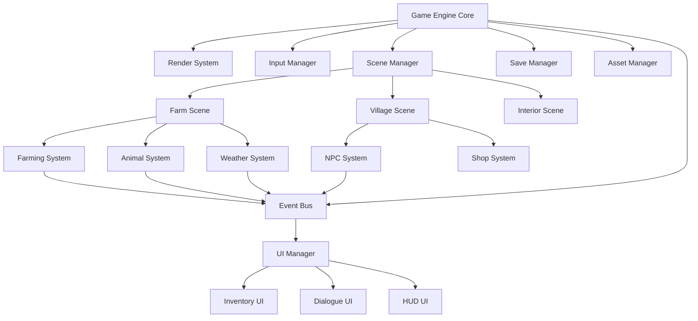

# Design Document

## Overview

The Harvest Moon web game uses a modular architecture built on JavaScript ES6+ modules with Canvas/WebGL rendering. The system follows an Entity-Component-System (ECS) pattern for game objects, Model-View-Controller (MVC) for UI components, and event-driven communication between subsystems. The game runs at 60fps with optimized sprite batching and viewport culling for performance.

The core engine manages rendering, input, collision detection, and game loop timing. Game systems handle farming, animals, NPCs, weather, and progression independently while communicating through a centralized event bus. Save data persists to localStorage with JSON serialization and validation.

## Architecture



## Components and Interfaces

### Core Engine Components

**GameEngine**
- Manages main game loop at 60fps using requestAnimationFrame
- Coordinates system updates and rendering passes
- Handles scene transitions and state management
- Interfaces: `start()`, `stop()`, `setScene(scene)`, `update(deltaTime)`

**RenderSystem**
- Canvas/WebGL context management with sprite batching
- Viewport culling for performance optimization
- Tile-based map rendering with layered sprites
- Animation frame management and interpolation
- Interfaces: `render(entities)`, `setBatch(sprites)`, `setCamera(x, y)`

**InputManager**
- Keyboard input handling with configurable key bindings
- Mouse/touch input for UI interactions
- Input state buffering for consistent frame timing
- Interfaces: `isKeyPressed(key)`, `getMousePosition()`, `bindKey(key, action)`

**AssetManager**
- Sprite sheet loading with JSON metadata parsing
- Audio file preloading and caching
- Progressive loading with priority queuing
- Interfaces: `loadSprite(path)`, `getSprite(id)`, `preloadAssets(list)`

### Game Systems

**FarmingSystem** (Requirement 2)
- Manages crop lifecycle state machines (planted → growing → mature → harvested)
- Handles soil tilling, watering, and growth timing
- Seasonal crop restrictions and growth rate modifiers
- Interfaces: `tillSoil(x, y)`, `plantSeed(x, y, seedType)`, `waterCrop(x, y)`, `harvestCrop(x, y)`

**AnimalSystem** (Requirement 3)
- Animal behavior state machines (hungry → fed → happy → producing)
- Building capacity management (barn/coop space allocation)
- Product generation timing and quality calculations
- Interfaces: `feedAnimal(id)`, `petAnimal(id)`, `collectProduct(id)`, `purchaseAnimal(type)`

**NPCSystem** (Requirement 4)
- Daily routine scheduling with pathfinding AI
- Dialogue tree traversal with relationship tracking
- Gift preference matrices and relationship point calculations
- Interfaces: `startDialogue(npcId)`, `giveGift(npcId, item)`, `getRelationshipLevel(npcId)`

**WeatherSystem** (Requirement 5)
- Season progression with calendar date tracking
- Weather pattern generation with probability tables
- Environmental effect application (rain waters crops, snow blocks growth)
- Interfaces: `getCurrentSeason()`, `getWeather()`, `advanceDay()`, `triggerWeatherEvent(type)`

### Data Models

**Player Entity**
```javascript
{
  id: "player",
  position: {x: 0, y: 0},
  sprite: "player_idle",
  inventory: Map<string, number>,
  stamina: {current: 100, max: 100},
  money: 0,
  tools: Map<string, ToolData>,
  relationships: Map<string, number>
}
```

**Crop Entity**
```javascript
{
  id: string,
  position: {x: number, y: number},
  cropType: string,
  growthStage: number,
  maxStages: number,
  waterLevel: number,
  daysSinceWatered: number,
  seasonRestrictions: string[]
}
```

**Animal Entity**
```javascript
{
  id: string,
  animalType: string,
  happiness: number,
  hunger: number,
  lastFed: Date,
  productType: string,
  productReady: boolean,
  building: string
}
```

**NPC Entity**
```javascript
{
  id: string,
  name: string,
  position: {x: number, y: number},
  schedule: DailyRoutine[],
  currentActivity: string,
  dialogueTree: DialogueNode,
  relationshipPoints: number,
  giftPreferences: Map<string, number>
}
```

**Save Data Structure**
```javascript
{
  version: "1.0.0",
  player: PlayerEntity,
  farm: {
    crops: CropEntity[],
    animals: AnimalEntity[],
    buildings: BuildingData[]
  },
  world: {
    currentSeason: string,
    currentDay: number,
    weather: WeatherState
  },
  npcs: NPCEntity[],
  gameState: {
    unlockedAreas: string[],
    completedEvents: string[],
    achievements: string[]
  },
  timestamp: Date
}
```

## Error Handling

**Save System Failures** (Requirement 9)
- localStorage quota exceeded: Compress save data, remove old backups
- Corrupted save data: Validate JSON schema, fall back to previous backup
- Version mismatch: Run migration functions to update save format
- Browser compatibility: Detect localStorage support, provide graceful degradation

**Asset Loading Failures** (Requirement 10)
- Missing sprite files: Use placeholder sprites, log errors for debugging
- Network timeouts: Implement retry logic with exponential backoff
- Invalid asset formats: Validate file headers, show user-friendly error messages
- Memory constraints: Implement asset streaming for large sprite sheets

**Game State Errors**
- Invalid crop growth states: Reset to previous valid state, log analytics
- NPC pathfinding failures: Use fallback movement patterns
- Collision detection glitches: Apply position correction with smoothing
- Performance degradation: Dynamically reduce visual quality, skip non-essential updates

**UI System Errors**
- Inventory overflow: Prevent item pickup, show fullness warning
- Dialogue system crashes: Close dialogue, restore game control
- Input binding conflicts: Reset to default configuration
- Render context loss: Reinitialize WebGL context, reload textures

## Testing Strategy

**Unit Testing**
- Game system logic: Crop growth calculations, animal happiness formulas, relationship point changes
- Data model validation: Save/load serialization, entity state transitions
- Utility functions: Math helpers, collision detection, pathfinding algorithms
- Test framework: Jest with custom game object mocks

**Integration Testing**
- System interaction: Farming + weather effects, NPC + dialogue + relationships
- Save/load cycles: Data persistence across browser sessions
- Scene transitions: Asset cleanup, state preservation
- Event bus communication: Message delivery, subscription management

**Performance Testing**
- Frame rate benchmarking: 60fps maintenance under various loads
- Memory usage profiling: Asset caching efficiency, garbage collection impact
- Render pipeline optimization: Sprite batching effectiveness, culling accuracy
- Load testing: Large farm sizes, multiple simultaneous animations

**End-to-End Testing**
- Complete gameplay scenarios: Full day cycles, seasonal transitions
- Progression paths: Tool upgrades, building expansions, relationship development
- Edge cases: Boundary conditions, resource limits, timing edge cases
- Browser compatibility: Chrome, Firefox, Safari, Edge testing matrix

**Visual Testing**
- Sprite animation correctness: Frame timing, loop seamless playback
- UI layout responsiveness: Different screen sizes, zoom levels
- Color palette accuracy: Seasonal themes, weather effects
- Accessibility: Color contrast, text readability, keyboard navigation

## Performance Optimizations

**Rendering Optimizations** (Requirement 10)
- Sprite batching: Group similar sprites into single draw calls
- Viewport culling: Only render entities within camera view
- Dirty rectangle tracking: Update only changed screen regions
- Texture atlasing: Combine small sprites into larger textures
- Level-of-detail: Reduce animation complexity at distance

**Memory Management**
- Asset streaming: Load/unload sprites based on current scene
- Object pooling: Reuse entity objects instead of creating new ones
- Garbage collection optimization: Minimize object allocation in game loop
- Compressed save data: Use efficient serialization formats

**CPU Optimizations**
- Spatial partitioning: Grid-based collision detection for efficiency
- Update frequency scaling: Run non-critical systems at lower framerates
- Pathfinding caching: Store and reuse NPC movement calculations
- Event batching: Process multiple events per frame efficiently

## Security Considerations

**Save Data Integrity**
- Input validation: Sanitize all user data before storage
- Save file encryption: Prevent save game tampering
- Version control: Detect and handle modified save files
- Backup validation: Verify backup integrity before restoration

**Asset Security**
- Content Security Policy: Prevent XSS attacks through asset loading
- Resource limits: Prevent memory exhaustion attacks
- File type validation: Ensure only expected asset formats are loaded
- Error message sanitization: Avoid information leakage in error responses